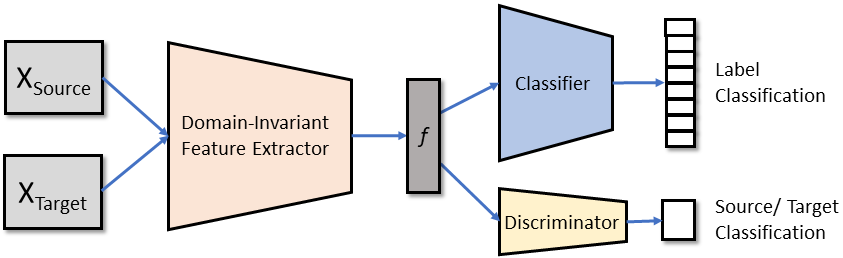

# Adversarial Domain Adaptation

Following is a **_Keras_** implementation of an Adversarial Domain Adaptation Model that assigns class labels to images in the _Target_ domain by extracting domain-invariant features from the labelled _Source_ and unlabelled _Target_ domain images. The architecture involves three sub-networks: _(a) domain-invariant feature extractor, (b) classifier and (c) domain discriminator._





## Dataset Download 

The code is tested on the **_Office-31_** dataset.
- Download it from this link: [Office-31](https://drive.google.com/file/d/0B4IapRTv9pJ1WGZVd1VDMmhwdlE/view).
- Create a *domain_adaptation_images* directory under *Data/Office/* and place the downloaded images inside.
- Image paths, along with the corresponding class labels, are listed in the _.txt_ files present in the _Office_ directory. 
- The _Data_ directory structure should look like this:

```
.
├── Data
|     └── Office
|          ├── domain_adaptation_images 
|          |           └── place the office-31 image folders here (amazon, dslr, webcam)
|          ├── amazon_10_list.txt
|          ├── amazon_31_list.txt
|          ├── dslr_10_list.txt
|          ├── dslr_31_list.txt
|          ├── webcam_31_list.txt
|          └── webcam_10_list.txt
└── ...

```

## Requirements

This code is compatible with the mentioned versions of the following libraries. However, it might also be compatible with their prior versions.

> pillow 6.0.0\
> scikit-learn 0.20.2\
> tensorflow 1.12.0\
> keras 2.2.4

## Model Specifications

**Domain-Invariant Feature Extractor:**

- **Model**     : _Resnet50_ (initialized with _'imagenet'_ weights)
- **Loss**      : _**w**<sub>1</sub> * classifier loss - **w**<sub>2</sub> * discriminator loss (**w**<sub>1</sub> = classifier loss weight and **w**<sub>2</sub> = discriminator loss weight)_
  - The gradient-reversal process is done in a GAN fashion where the domain labels are flipped for the _Source_ and _Target_.
- **Optimizer** : _Adam_

**Classifier:**

- **Model**     : _Dense(400) --> Dense(100) --> Dense(number of classes)_
- **Loss**      : _Categorical cross-entropy_
- **Optimizer** : _Adam_

**Domain Discriminator:**

- **Model**     : _Dense(400) --> Dense(100) --> Dense(1)_
- **Loss**      : _Binary cross-entropy_
- **Optimizer** : _Adam_


## Model Run

The model outputs the _Target_labels_ and the _Source_ and _Target classification_ accuracies, which are saved under the _Snapshot/Models_ directory.

- An example starter code is given below:

```
python driver.py --batch_size 32 --number_of_gpus 2 --lr_combined 0.00001 --num_iterations 5000
```

- Parameters:

| Parameter Name | Default Value | Description |
|:---:|:---:|:---:|
| `--number_of_gpus` | default = '1' | "Number of gpus required to run" |
| `--network_name` | default = 'ResNet50' | "Name of the feature extractor network" |
| `--dataset_name` | default = 'Office' | "Name of the source dataset" |
| `--dropout_classifier` | default = 0.25 | "Dropout ratio for classifier" |
| `--dropout_discriminator` | default = 0.25 | "Dropout ratio for discriminator" |
| `--source_path` | default = 'amazon_10_list.txt' | "Path to source dataset" |
| `--target_path` | default = 'webcam_10_list.txt' | "Path to target dataset" |
| `--lr_classifier` | default = 0.0001 | "Learning rate for classifier model" |
| `--lr_discriminator` | default = 0.0001 | "Learning rate for discriminator model" |
| `--lr_combined` | default = 0.00001 | "Learning rate for combined model" |
| `--b1_classifier` | default = 0.9 | "Exponential decay rate of first moment for classifier model optimizer" |
| `--b2_classifier` | default = 0.999 | "Exponential decay rate of second moment for classifier model optimizer" |
| `--b1_discriminator` | default = 0.9 | "Exponential decay rate of first moment for discriminator model optimizer" |
| `--b2_discriminator` | default = 0.999 | "Exponential decay rate of second moment for discriminator model optimizer" |
| `--b1_combined` | default = 0.9 | "Exponential decay rate of first moment for combined model optimizer" |
| `--b2_combined` | default = 0.999 | "Exponential decay rate of second moment for combined model optimizer" |
| `--classifier_loss_weight` | default = 1 | "Classifier loss weight" |
| `--discriminator_loss_weight` | default = 4 | "Discriminator loss weight" |
| `--batch_size` | default = 32 | "Batch size for training" |
| `--test_interval` | default = 3 | "Minimum gap between two successive test phases" |
| `--num_iterations` | default = 12000 | "Number of iterations" |
| `--snapshot_interval` | default = 500 | "Gap between saving output models" |
| `--output_dir` | default = 'models' | "Directory for saving output model" |

## Acknowledgements

The following code has drawn inspiration from the following papers:

- *Ganin, Yaroslav, and Victor Lempitsky. "Unsupervised domain adaptation by backpropagation."* [\[Link\]](https://github.com/S-Choudhuri/Adversarial-Domain-Adaptation-with-Keras/blob/master/Papers/Unsupervised_Domain_Adaptation_by_Backpropagation.pdf)

- *Li, Yanghao, Naiyan Wang, Jianping Shi, Jiaying Liu, and Xiaodi Hou. "Revisiting batch normalization for practical domain adaptation."* [\[Link\]](https://github.com/S-Choudhuri/Adversarial-Domain-Adaptation-with-Keras/blob/master/Papers/Revisiting_Batch_Normalization_for_Practical_Domain_Adaptation.pdf)

- *Tzeng, Eric, Judy Hoffman, Kate Saenko, and Trevor Darrell. "Adversarial discriminative domain adaptation."* [\[Link\]](https://github.com/S-Choudhuri/Adversarial-Domain-Adaptation-with-Keras/blob/master/Papers/Adversarial_Discriminative_Domain.pdf)

## License

[](https://github.com/S-Choudhuri/Adversarial-Domain-Adaptation-with-Keras/blob/master/LICENSE)
